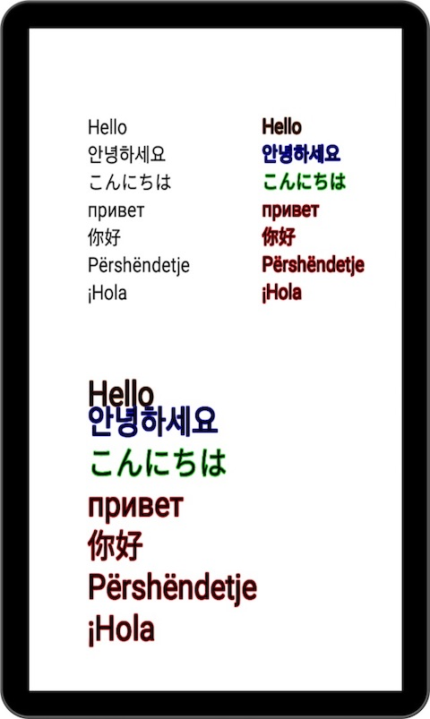
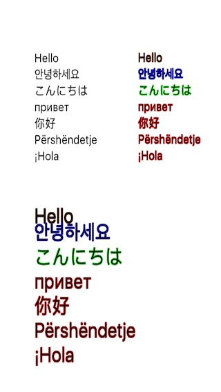
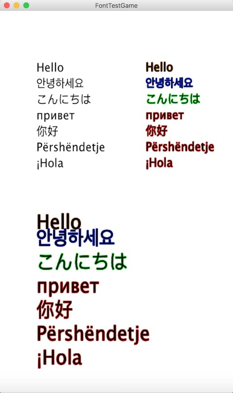

##Welcome to NativeFont

NativeFont is an custom bitmapfont library that is used to create freedom Labels.

## About Nativefont

Make Native bitmapFont from Native code. Android Bitmap or IOS UILabel or Desktop Graphics2D

##Features

- [x] No External ttf
- [x] Cross-platform
- [x] Convenience
- [x] Open Source

## Requirements

* Libgdx 1.6+
* Robovm fork 2.0+
* MOE 1.1+

## Usage

Please see the test/[FontTest.java](core/src/net/mwplay/nativefont/test/FontTest.java)
```
NativeFont font50 = new NativeFont(fontListener, new NativeFontPaint(50));
        font50.appendText(DEFAULT_CHARS);
        fonts.put("font50", font50);
```
```
label = new NativeLabel("", new Label.LabelStyle(game.fonts.get("font50"), Color.BLACK));
        label.setText(text);
        label.setPosition(pos.x, pos.y);
        stage.addActor(label);
```

## ScreenShot

###Android:

###IOS:

###Desktop:


## Thank

Var3d: [http://blog.csdn.net/aijiuziji/article/details/48074193](http://blog.csdn.net/aijiuziji/article/details/48074193)

## License

NativeFont is licensed under the [Apache 2 License](http://www.apache.org/licenses/LICENSE-2.0.html), meaning you can use it free of charge, without strings attached in commercial and non-commercial projects. 
